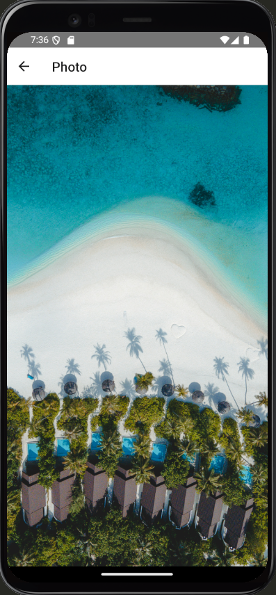

# Unsplash Photo Gallery

## Description

This project is a small application built using React-Native that displays photos from Unsplash. The application fetches photo data in JSON format from the Unsplash API and presents it in a gallery format. It is designed to demonstrate the use of various technologies and libraries such as Redux, Redux Thunk, React Navigation, and others.

## Task

Implement a gallery based on React-Native (not React.js) that will display photos from Unsplash. This application should fetch resources in JSON format.

## API Documentation

[Unsplash API Documentation](https://unsplash.com/documentation)

## Features

The application contains two screens:

1. List Screen
   1. Thumbnail image with title and author
   2. When the user clicks on the image, it opens the photo screen
2. Photo Screen
   1. Displays a single photo occupying the maximum area.

## Technologies Used

- React-Native: Framework for building native apps using React.
- Redux: State management library.
- Redux Thunk: Middleware for handling asynchronous actions in Redux.
- ES6 (JavaScript) or TypeScript: Modern JavaScript features or TypeScript for type safety.
- Flexbox: CSS layout model for designing responsive layouts.
- React Navigation: Library for navigating between screens.
- axios: Promise-based HTTP client for making API requests.

## Installation

1. Clone the repository

````bash
git clone https://github.com/YaroslavKotovDev/Audety.git
cd Audety
````

2. Install dependencies

````bash
npm install
````

3. Link native dependencies (if needed)

````bash
npx react-native link
````

4. Run the app on Android

````bash
npx react-native run-android
````

5. Run the app on iOS

````bash
npx react-native run-ios
````

## Project Structure

````plaintext
/src
  /actions
    index.ts            # Action creators for Redux
  /reducers
    index.ts            # Root reducer
    photoReducer.ts     # Reducer for handling photo-related state
  /screens
    ListScreen.tsx      # Screen displaying list of photos
    PhotoScreen.tsx     # Screen displaying a single photo
  /components
    PhotoItem.tsx       # Component for rendering individual photo items
  /navigation
    AppNavigator.tsx    # Navigation configuration
/App.tsx                # Root component wrapping navigation in Redux provider
````

## Screenshots

1. List Screen
   


1. Photo Screen

